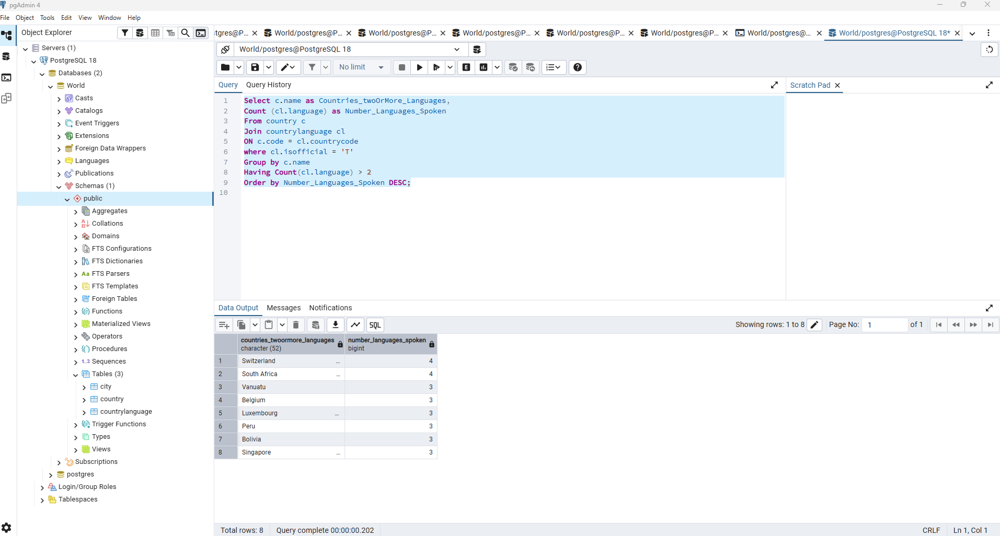
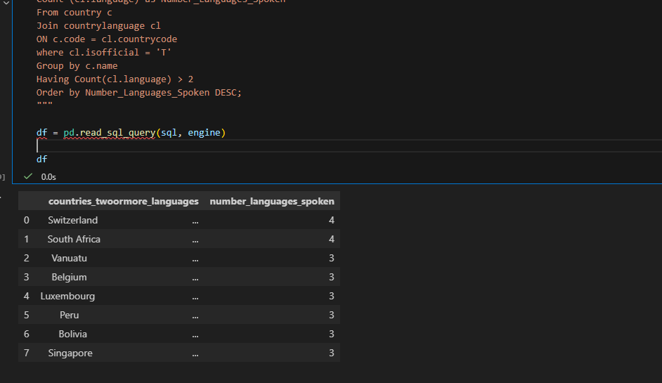
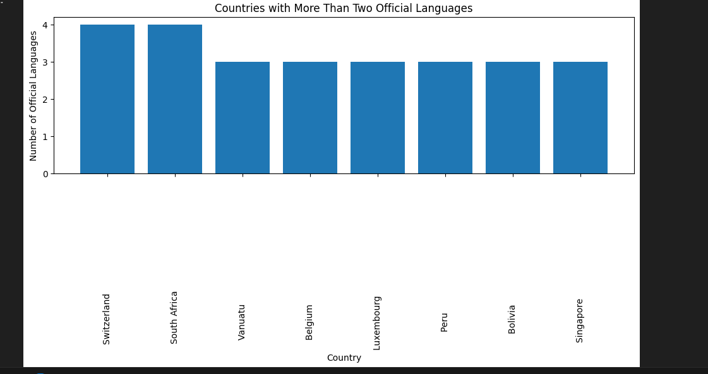

# Exercise 04: Advanced SQL, Jupyter, and Visualization

- Name: Houston Asher-Laws
- Course: Database for Analytics
- Module: 04
- Database Used: World Database
- Tools Used: PostgreSQL, SQLAlchemy, Pandas, Jupyter Notebooks

---

## Instructions

- Complete each task using the **World database** installed earlier.
- For SQL questions:
  - Write the SQL command in a fenced code block
  - Execute the command and include a **screenshot of the results**
- For Jupyter Notebook questions:
  - Include the required Python statements
  - Include **screenshots of the notebook output**
- Store all screenshots in the `screenshots/` folder and embed them below each question.

---

## Question 1

Considering the World database, write a SQL statement that will **display the names of countries that speak more than two official languages**, along with the **number of official languages spoken**.

- Sort the results by **number of languages**, from **most to least**.
- *Hint: There are fewer than 10 countries in the results.*

### SQL

```sql
Select c.name as Countries_twoOrMore_Languages,
Count (cl.language) as Number_Languages_Spoken
From country c
Join countrylanguage cl
ON c.code = cl.countrycode
where cl.isofficial = 'T'
Group by c.name
Having Count(cl.language) > 2
Order by Number_Languages_Spoken DESC;
```

### Screenshot



---

## Question 2

Using **Jupyter Notebooks**, you must use the `create_engine` command to connect to your database.

After the `create_engine` command is executed, **what are the three statements required to execute the query from Question 1 and display the results in the notebook**?

### Python Code

```python
## first statement
import os
import sqlalchemy
from dotenv import load_dotenv
from sqlalchemy import create_engine
import matplotlib.pyplot as plt
import pandas as pd


load_dotenv()

engine = create_engine(os.getenv("DATABASE_URL"))

## Second Statement
pd.read_sql_query("SELECT 1 AS ok;", engine)

## Thrid Statement 
sql = """
Select c.name as Countries_twoOrMore_Languages,
Count (cl.language) as Number_Languages_Spoken
From country c
Join countrylanguage cl
ON c.code = cl.countrycode
where cl.isofficial = 'T'
Group by c.name
Having Count(cl.language) > 2
Order by Number_Languages_Spoken DESC;
"""

df = pd.read_sql_query(sql, engine)

df
```

### Screenshot



---

## Question 3

Using **Jupyter Notebooks**, write the Python code needed to produce the following graph:


(The graph shows country-level results derived from the World database.)

### Python Code

```python
plt.figure(figsize=(10, 6))

plt.bar(df["countries_twoormore_languages"], 
        df["number_languages_spoken"])

plt.title("Countries with More Than Two Official Languages")
plt.xlabel("Country")
plt.ylabel("Number of Official Languages")

plt.xticks(rotation=90)
plt.tight_layout()
plt.show()
```

### Screenshot


