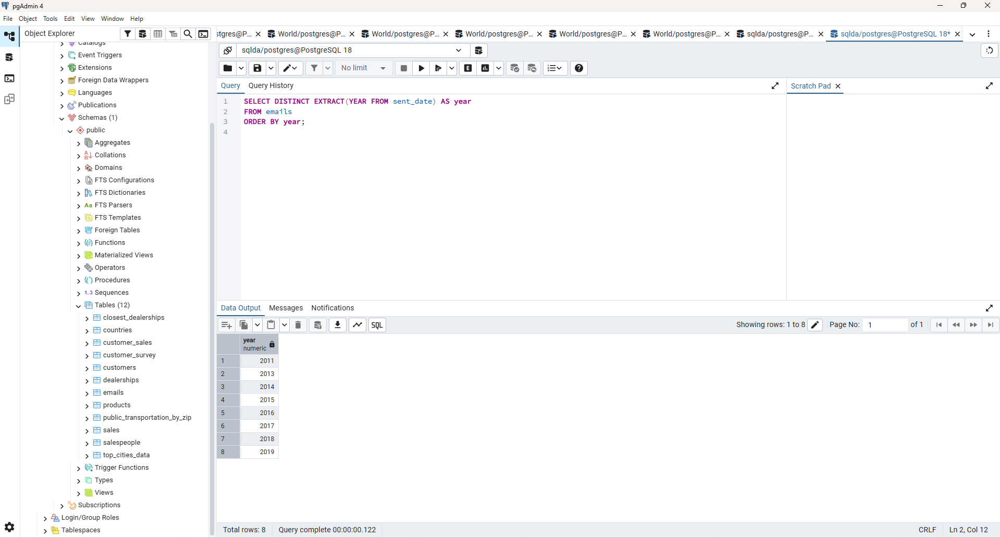
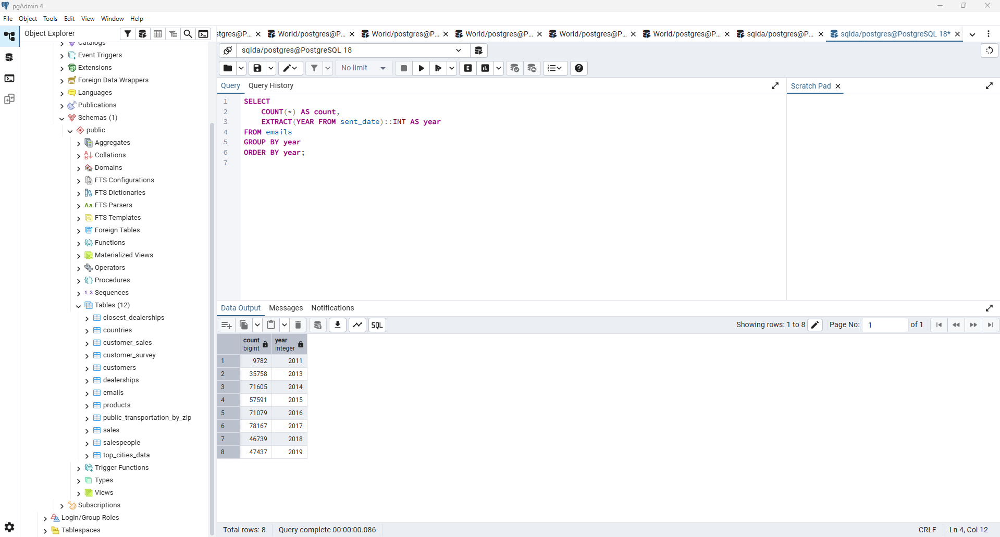
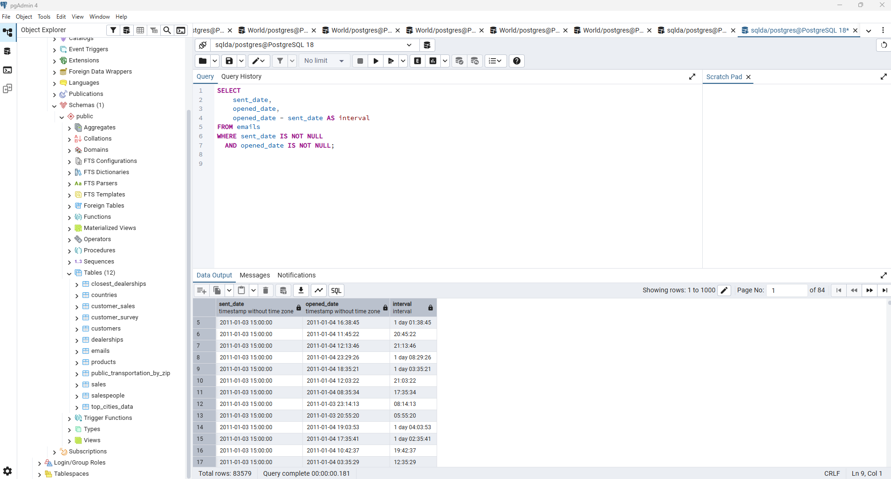
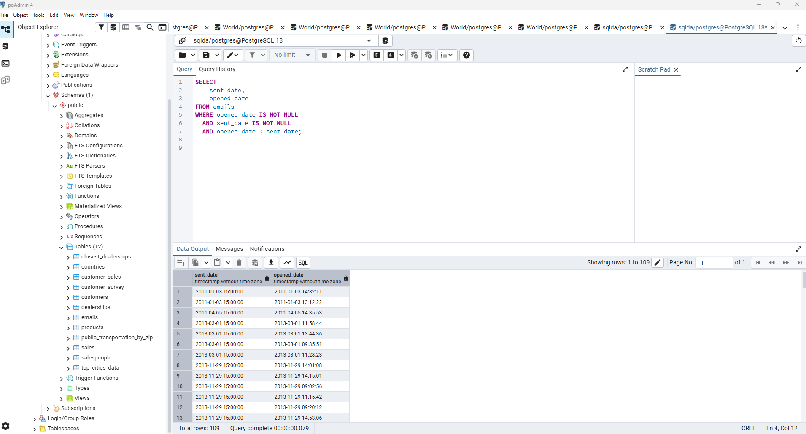
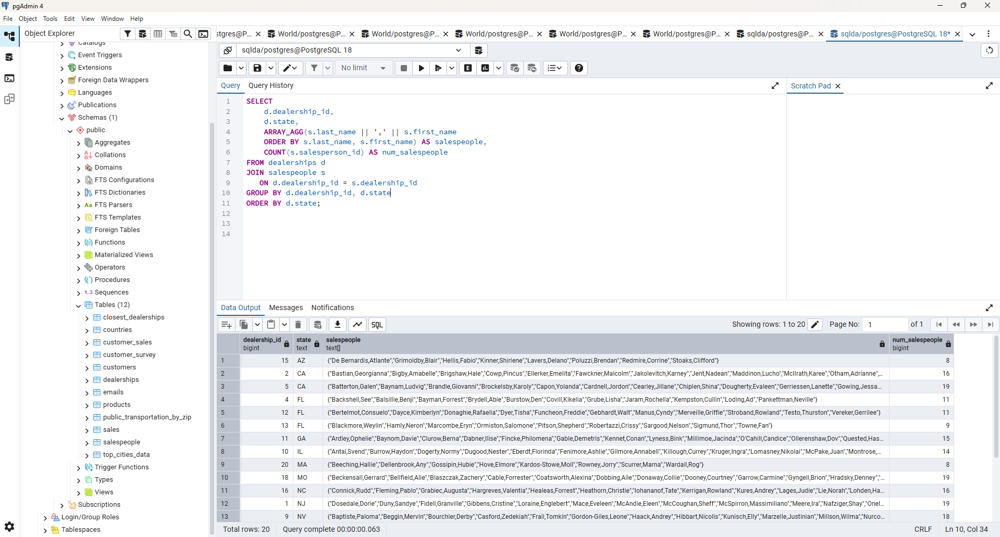
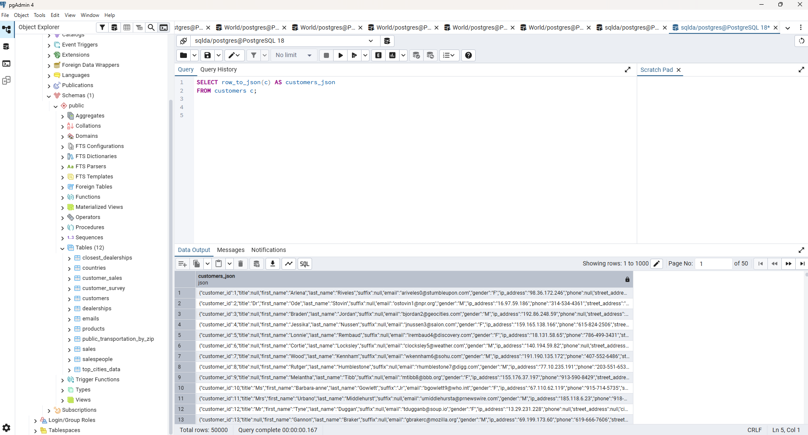
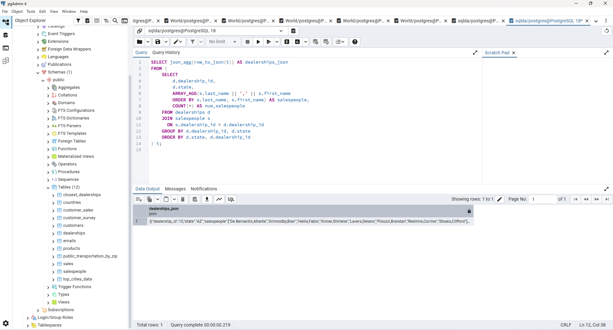

# Exercise 05: SQLDA Database - Dates, Data Quality, Arrays, and JSON

- Name: Houston Asher-Laws
- Course: Database for Analytics
- Module: 05
- Database Used:  `sqlda` (Sample Datasets)
- Tools Used: PostgreSQL (pgAdmin or psql)

---

## Instructions

- Use the **sqlda** database from the "Loading the Sample Datasets" instructions.
- For each SQL task:
  - Include your SQL in a fenced code block
  - Execute it and include a **screenshot** showing the query and results
- Store screenshots in the `screenshots/` folder and embed them below each answer.
- For explanation questions:
  - Write your answer in complete sentences
  - Include a screenshot if requested

---

## Question 1

Using the `sqlda` database, write the SQL needed to show a **list of years** that emails were sent.

Your results should list years like this (order matters):

```
year
2011
2013
2014
2015
2016
2017
2018
2019
```

### SQL

```sql
SELECT DISTINCT EXTRACT(YEAR FROM sent_date) AS year
FROM emails
ORDER BY year;

```

### Screenshot



---

## Question 2

Using the `sqlda` database, write the SQL needed to show the **number of messages sent by year**, ordered by year (as shown in the prompt).

Output should resemble:

```
count   year
...
```

### SQL

```sql
SELECT 
    COUNT(*) AS count,
    EXTRACT(YEAR FROM sent_date)::INT AS year
FROM emails
GROUP BY year
ORDER BY year;
```

### Screenshot



---

## Question 3

Using the `sqlda` database, write the SQL needed to show:
- the **sent date**
- the **opened date**
- the **interval** between the two

Only include emails that contain **both** a sent date and an opened date.

### SQL

```sql
SELECT 
    sent_date,
    opened_date,
    opened_date - sent_date AS interval
FROM emails
WHERE sent_date IS NOT NULL
  AND opened_date IS NOT NULL;

```

### Screenshot



---

## Question 4

Using the `sqlda` database, write the SQL needed to show emails that contain an **opened date BEFORE the sent date**.

### SQL

```sql
SELECT 
    sent_date,
    opened_date
FROM emails
WHERE opened_date IS NOT NULL
  AND sent_date IS NOT NULL
  AND opened_date < sent_date;

```

### Screenshot



---

## Question 5

Using the `sqlda` database: there are **over 100 emails** that contain an opened date **BEFORE** the sent date.

After looking at the data, **why is this the case?**

### Answer

The send date is consistently recorded at 15:00 due to how time zones are handled in the dataset. Because of this standardized send time, some emails appear to have been opened before they were sent. In reality, the send time does not reflect the actual moment the email was sent, while the opened date captures the true timestamp of when the email was opened.
### Screenshot (if requested by instructor)


---

## Question 6

Using the `sqlda` database, explain in your own words what the following code does:

```sql
CREATE TEMP TABLE customer_points AS (
    SELECT
        customer_id,
        point(longitude, latitude) AS lng_lat_point
    FROM customers
    WHERE longitude IS NOT NULL
    AND latitude IS NOT NULL
);

CREATE TEMP TABLE dealership_points AS (
    SELECT
        dealership_id,
        point(longitude, latitude) AS lng_lat_point
    FROM dealerships
);

CREATE TEMP TABLE customer_dealership_distance AS (
    SELECT
       customer_id,
       dealership_id,
       c.lng_lat_point <@> d.lng_lat_point AS distance
    FROM customer_points c
    CROSS JOIN dealership_points d
);
```

### Answer

The first temporary table creates a table that calculates a geometric point for each customer using the point() function and their longitude and latitude values.

The second temporary table does the same thing, but for each dealership.

The third temporary table uses a CROSS JOIN to create every possible pair between customers and dealerships. It then uses the <@> operator to calculate the distance between each customer’s location point and each dealership’s location point.

---

## Question 7

Using the `sqlda` database, write SQL to display an **array of salespeople for each dealership**, sorted by dealership.

For example - dealership 1 is below:

```text
"{""Fidell,Granville"",""Onele,Jereme"",""Sheriff,Lelia"",""McSpirron,Massimiliano"",""Rennick,Nadia"",""Mace,Eveleen"",""Oxteby,Dukie"",""Spong,Marcos"",""Wogden,Quent"",""Duny,Sandye"",""Loraine,Englebert"",""Meere,Ira"",""Gibbens,Cristine"",""Prine,Lyda"",""McCoughan,Sheff"",""Schule,Giselbert"",""McAndie,Eleen"",""Dosedale,Dorie"",""Nafziger,Shay""}"
```

### SQL

```sql
SELECT 
    dealership_id,
    ARRAY_AGG(last_name || ',' || first_name ORDER BY last_name, first_name) 
        AS salespeople
FROM salespeople
GROUP BY dealership_id
ORDER BY dealership_id;
```

### Screenshot


---

## Question 8

Using the `sqlda` database, write SQL to display:
- an **array of salespeople for each dealership**
- the **state** of the dealership
- the **number of salespeople** for the dealership

Sort by **state**.

Reference image:


### SQL

```sql
SELECT
    d.dealership_id,
    d.state,
    ARRAY_AGG(s.last_name || ',' || s.first_name 
    ORDER BY s.last_name, s.first_name) AS salespeople,
    COUNT(s.salesperson_id) AS num_salespeople
FROM dealerships d
JOIN salespeople s
   ON d.dealership_id = s.dealership_id
GROUP BY d.dealership_id, d.state
ORDER BY d.state;

```

### Screenshot



---

## Question 9

Using the `sqlda` database, write the SQL needed to convert the **customers** table to **JSON**.

### SQL

```sql
SELECT row_to_json(c) AS customers_json
FROM customers c;

```

### Screenshot



---

## Question 10

Using the `sqlda` database, write SQL to display:
- an **array of salespeople for each dealership**
- the **state**
- the **number of salespeople**
- sorted by **state**

Then **convert this result to JSON**.

Reference image:


### SQL

```sql
SELECT json_agg(row_to_json(t)) AS dealerships_json
FROM (
    SELECT
        d.dealership_id,
        d.state,
        ARRAY_AGG(s.last_name || ',' || s.first_name
        ORDER BY s.last_name, s.first_name) AS salespeople,
        COUNT(*) AS num_salespeople
    FROM dealerships d
    JOIN salespeople s
      ON s.dealership_id = d.dealership_id
    GROUP BY d.dealership_id, d.state
    ORDER BY d.state, d.dealership_id
) t;

```

### Screenshot


