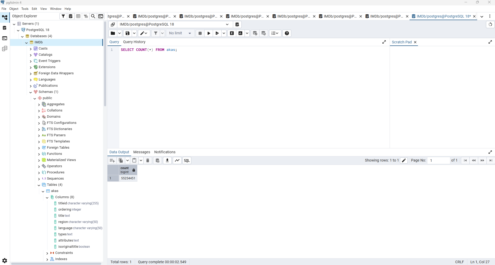
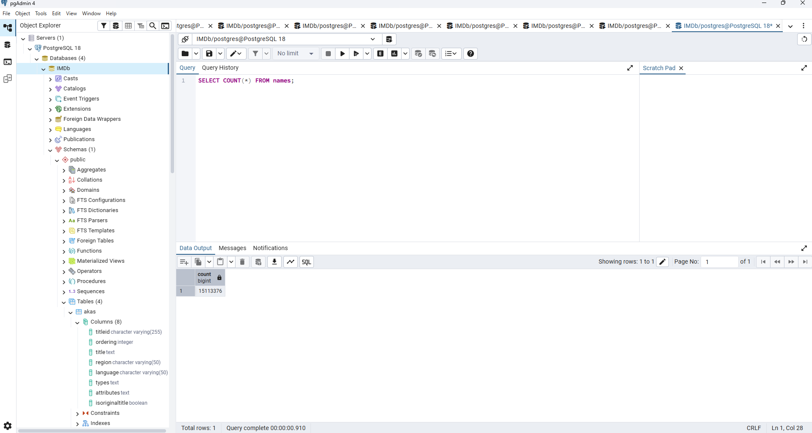
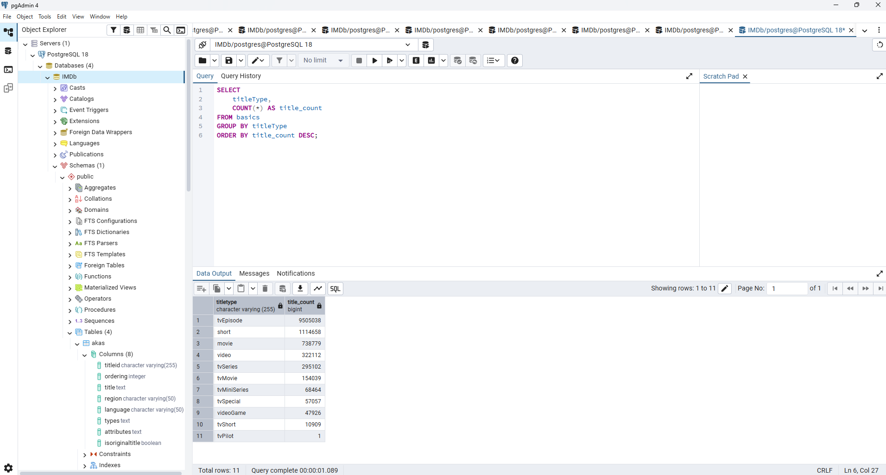

# Houston Asher-Laws Module 7

1. The initial data source that I used was from the IMBd Non-Commericail Datasets

2. The tables that I used from this data set were title.akas.tsv, title.basics.tsv, and name.basics.tsv

3. Here are some of my table strucutre.

title.akas.tsv.gz
titleId (string) - a tconst, an alphanumeric unique identifier of the title
ordering (integer) – a number to uniquely identify rows for a given titleId
title (string) – the localized title
region (string) - the region for this version of the title
language (string) - the language of the title
types (array) - Enumerated set of attributes for this alternative title. One or more of the following: "alternative", "dvd", "festival", "tv", "video", "working", "original", "imdbDisplay". New values may be added in the future without warning
attributes (array) - Additional terms to describe this alternative title, not enumerated
isOriginalTitle (boolean) – 0: not original title; 1: original title

title.basics.tsv.gz
tconst (string) - alphanumeric unique identifier of the title
titleType (string) – the type/format of the title (e.g. movie, short, tvseries, tvepisode, video, etc)
primaryTitle (string) – the more popular title / the title used by the filmmakers on promotional materials at the point of release
originalTitle (string) - original title, in the original language
isAdult (boolean) - 0: non-adult title; 1: adult title
startYear (YYYY) – represents the release year of a title. In the case of TV Series, it is the series start year
endYear (YYYY) – TV Series end year. '\N' for all other title types
runtimeMinutes – primary runtime of the title, in minutes
genres (string array) – includes up to three genres associated with the title

name.basics.tsv.gz
nconst (string) - alphanumeric unique identifier of the name/person
primaryName (string)– name by which the person is most often credited
birthYear – in YYYY format
deathYear – in YYYY format if applicable, else '\N'
primaryProfession (array of strings)– the top-3 professions of the person
knownForTitles (array of tconsts) – titles the person is known for

4. The first obstacle that I had was the files were .tsv and not CSV which reqired me to decompression it before loading. Also had some troulbe with the \N vaules when I was trying to copy the data over. I had to configure the copy process to treat \N as Null. I also had some troulbe with the Windows file permission. But I was able to make a new folder in my C: drive which help me copy of the data successful. 

5. Here is a data Data dictionary that I made.

6. Here are some screen shots of the rows. 
   
   
    

7. Here are some queries that I made using Join and Aggregate data. 
   
   
